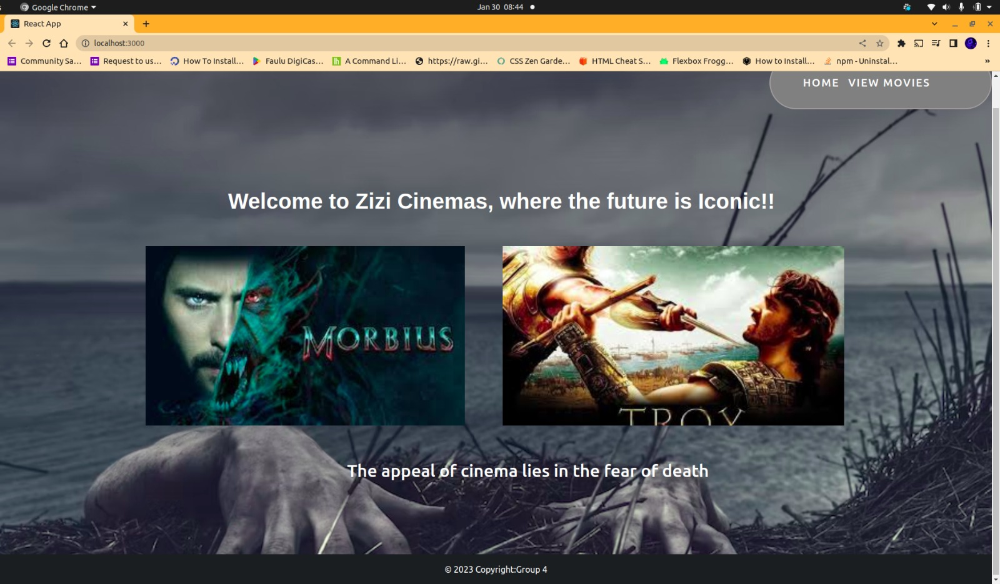

# Phase-2 Group 4 Project

This is a React App that generates movies by fetching movie data from the [The Open Movie Database(OMDB) public API](https://www.omdbapi.com/). 


* Link to live site on GitHub: https://github.com/Lik10280/Phase-2-project-grp4

* The following image demonstrates the application functionality:


 # Challenges faced.
The main challenge was finding the right public API to implement onto the project. Most public APIs are freemium, hence they are only available for use during the first 20 days of use.

# How to install and run the project.
To fetch data from our API in this project, you are required to fetch data from the [The Open Movie Database(OMDB) public API](https://www.omdbapi.com/). 


## User story:
```
As a user:
- I can search for movies
- I can add a movie to my list of favorite movies
- I can remove a movie from favorites
```
